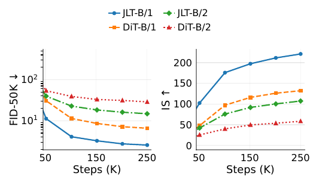

I am an undergraduate student (enrolled in 2024, currently a sophomore) deeply passionate about **Generative AI** and at the forefrontof deep learning research. My focus primarily lies in Latent Diffusion Models, Diffusion Transformers (DiTs), Large Language Model(LLM) Agents, and efficient inference techniques. 

Driven by strong academic curiosity and engineering capability, I activelybridge the gap between cutting-edge research and open-source community deployment. I have an extensive track record in training large-scale generative networks, building robust interactive frameworks, and developing high-performance inference acceleration systems.

---

## 📚 Research & Publications

### **JLT: Clean-Latent Prediction in Latent Diffusion Transformers**
**Funing Fu***, **Tenghui Wang***, Guanyu Zhou, Junyong Cen, Qichao Zhu
*( * Indicates Equal Contribution / Co-First Authorship )*

  <a href="[https://arxiv.org/abs/2605.27102](https://arxiv.org/abs/2605.27102)"><button style="background-color: #24292e; color: white; border: none; padding: 6px 12px; margin-right: 5px; border-radius: 4px; cursor: pointer;">PDF</button></a>
  <a href="[https://github.com/akatsuki-neo/JLT](https://github.com/akatsuki-neo/JLT)"><button style="background-color: #24292e; color: white; border: none; padding: 6px 12px; margin-right: 5px; border-radius: 4px; cursor: pointer;">Code</button></a>
  <ahref="[https://akatsuki-neo.github.io/JLT](https://akatsuki-neo.github.io/JLT)"><button style="background-color:#24292e; color: white; border: none; padding: 6px 12px; margin-right: 5px; border-radius: 4px; cursor: pointer;">Page</button></a>
  <a href="[https://huggingface.co/dawn-neo/JLT](https://huggingface.co/dawn-neo/JLT)"><button style="background-color: #24292e; color: white; border:none; padding: 6px 12px; margin-right: 5px; border-radius:4px; cursor: pointer;">HF</button></a>
  <a href="https://wwww.zhihu.com/question/1972662017648264174/answer/2044334746961019013](https://www.zhihu.com/question/1972662017648264174/answer/2044334746961019013)"><button style="background-color: #24292e; color: white; border: none; padding: 6px 12px; margin-right: 5px; border-radius:4px; cursor: pointer;">Blog</button></a>

#### Training Curves &Convergence Analysis

---

## 🚀 Open Source & Industry Experience

### **Neta Art & Lumina Team** |Core Trainer & Developer
* **Neta-Lumina**: Served as a core trainer and developer for the[Neta-Lumina](https://huggingface.co/neta-art/Neta-Lumina) project, managing large-scale pre-training and fine-tuning setups for high-quality artistic generation models.
* **TeaCache Integration**: Authored and integrated the [TeaCache](https://github.com/ali-vilab/TeaCache) implementation for**Lumina2**, significantly accelerating the inference speed of Diffusion Transformers by caching redundant time-step latents without sacrificing perceptualquality.

### **Chenkin Noob Community** | Active Core Developer
* Active developer within the[ChenkinNoob](https://huggingface.co/ChenkinNoob) open-source collective, contributing to highly-regarded generative assetsand specialized community foundation tools.
* **Style Clustering & Classification**: Spearheaded the development and training of an advanced artist-style clustering model. Developed and open-sourced [comfyui-lsnet](https://github.com/spawner1145/comfyui-lsnet.git), a highly popular ComfyUI custom node that garnered substantial traction and recognition within the generative artcommunity.

### **LLM Agents & Interactive Ecosystems** | Core Architect
* Maintained extensive full-stack AI development workflows focusing on natural language interactions and multi-agent coordination.
* Co-developed and serves as a core engineerfor [Eridanus](https://github.com/AOrbitron/Eridanus) and[Manyana](https://github.com/avilliai/Manyana.git), frameworks built to engineer sophisticated, production-grade LLM workflows, conversational memory systems, and tool-use orchestrations.

---

## 🛠️ Technical Skills

* **Deep Learning Frameworks**: PyTorch, Hugging Face `transformers`, `diffusers`, `accelerate`,DeepSpeed.
* **Generative AI & Architecture**: Latent Diffusion Models (LDM), Diffusion Transformers (DiT), FlowMatching, Attention Mechanics, VAEs.
* **Computer Vision & Perception**: Image Classification, Object Detection (YOLO, DETR series), Style Clustering, Feature Extraction.
* **LLMs & Systems**: Multi-Agent Orchestration, Tool-Calling/Function-Calling pipelines, Retrieval-Augmented Generation (RAG), High-Performance Inference Optimization(TeaCache, Quantization).
